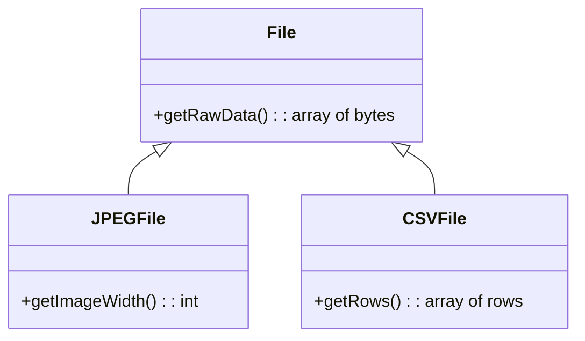
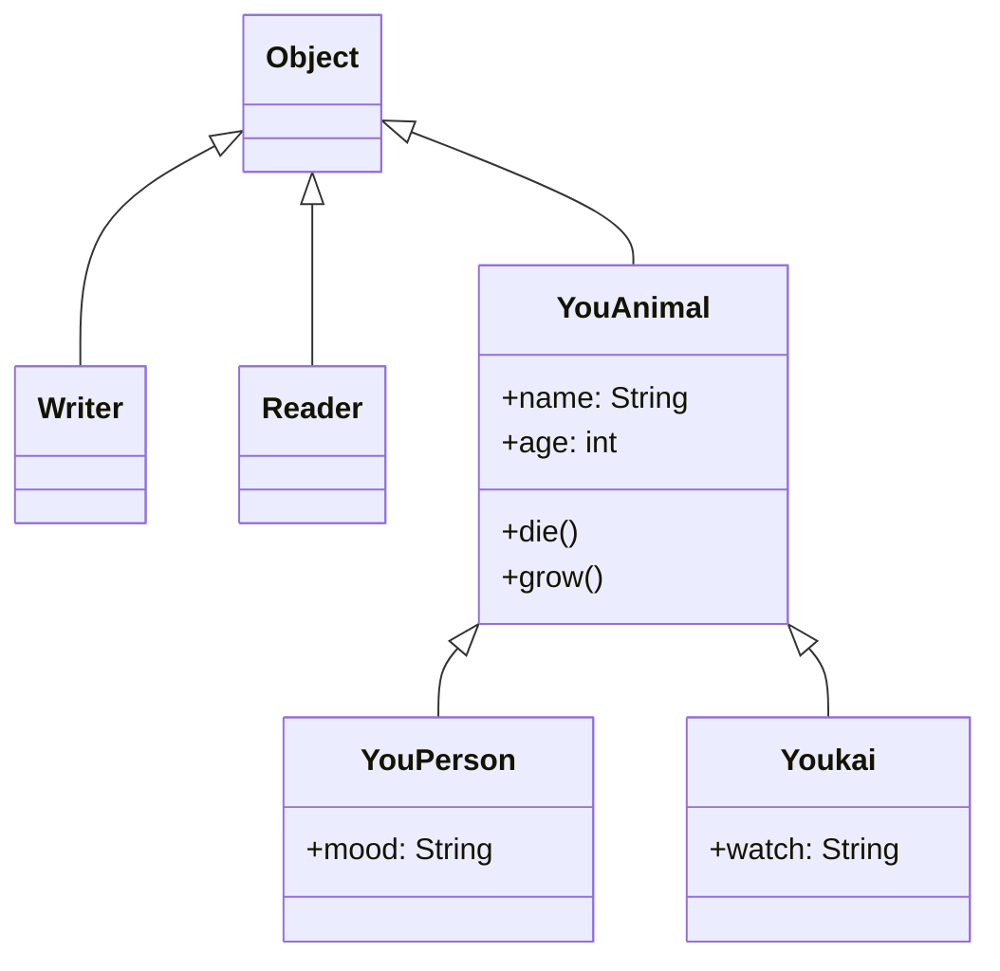
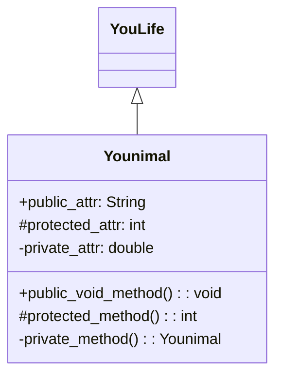

## Why OOP?
OOP is a philosophy for organising programs, similar to procedural and functional progamming.

In OOP, all actions that the program does is organised around the "object".
An object represents a state machine, or an abstraction that protects its internal state (represented by its instance variables) from corruption.
It primarily does this by limiting access to internal state (called encapsulation): objects only allow methods (written for the class) to edit its internal state (called behaviour, implemented by methods), allowing checks to be performed on the state modification.
Some OOP introductions also use the notion of identity, which is a unique reference to an object (typically an address in memory (CPython's `id()` builtin function)). It may also be equal to the variable name.

This is pretty abstract and confusing, so let's make things more concrete.

## Attributes and Methods

For example, in Smalltalk, `1` would be an object with a `+` attribute (called message in Smalltalk jargon).
`1 + 2` would mean "invoke the `+` method of `1` with an argument of `2`" (send a message `+` with arguments `2` in Smalltalk jargon).

Another example in Java:
```java
"OOP".replace('O', 'o') // becomes "ooP"
```
`"OOP"` is a `String` object, and has a `replace(char searchChar, char newChar)` method. This would invoke the method (behaviour), and return a new string "ooP".


Additionally, in Java (and other languages), `this` is used to refer to the object itself from methods and constructors.

```
class Person {
    private String name;
    Person(String name) {
        // this here refers to the class (only when using it as a constructor)
        this(name, -1);
    }
    Person(String name, int age) {
        // this here refers to the object being instantiated
        this.name = name;
        this.age = age;
    }
    void sayHi() {
        // this here refers to the current object
        System.out.printf("%s says hi.", this.name);
    }
}
```

Some languages (e.g. Python, Ruby) treat methods as attributes that happen to be methods. In Python:
```python3
# define blank class A
class A:
    pass

# instantiate new object b with class A
b = A()
# assign the print function to b.something
b.something = print
# call it like any method
b.something('Hello')
```

Finally, OOP has a notion of polymorphism, which means that many different objects and classes can be treated as the same one.
For example, we can have the following (simplified) class hierarchy:

[](https://mermaid.live/edit#pako:eNp1kM0KwjAMgF-l5KSoL1C8ORU9iQO99BLXbBbWTdqMMebe3f0JOjGXJB_JR0gNUa4JJEQpeh8YTBxalYk2eiJ2JiVRD6SLRUJ8xjJAxtlcCnQOK5HH4lYx-WGsGVK_uX6uVuJ42u677tP7ZlP3wWJCV6P53ulNxn-cm_AyVY7o59q89F-nuhaMVliCJWfR6PYF_Z4CvpMlBbItNcVYpKxAZd0oFpyHVRaBZFfQEoqHRqbxaSBjTD01L-c0aKo)




We can put a `JPEGFile` object into a variable with type `File`, and treat it as a `File` object, calling `getRawData()`, for example.
This allows us to use the same code and have slightly different functionality for the small parts (e.g. we can have a `OnlineFile` which accesses the file online for `getRawData()`).

Here's another example:

```java
public class YouLife {
    sleep() {
        System.out.println("I shall go sleep.");
    }
}
class Animal extends YouLife {
    public String name;
    YouLife(String name) { // define a constructor such that `new Animal("John")` works.
        this.name = name;
    }

    @override // signify that we want to override this method
    void sleep() {
        System.out.println(this.name + " goes to sleep.");
    }
}

YouLife l = new Animal("John");
l.sleep(); // calls Animal class' sleep method, but acts like a YouLife object
```

## Overloading

Java allows overloading methods and constructors. This means that methods and constructors can be dispatched by (argument) types. In more concrete terms, multiple implementations can share the same name as long as the argument types differ.

```
void think(String something) { /* ... */ } // 1st impl
void think() { /* ... */ } // 2nd impl

think() // calls the 2nd impl
think("Haskell is pretty cool.") // calls the 1st impl
```

Additionally, as overloading is only by argument types (not names), the following is invalid:

```
void method(String a) { /* ... */ }
void method(String b) { /* ... */ }
```

## Classes

Although classes are a staple of OOP, classes are not always required or even exist. For eaxmple, in JavaScript there is no class that has special behaviour compared to objects.
Classes can be thought of as a template to create objects. In languages like Java, an object can only be made using a class as a template (called instantiation).
They can also have attributes (instance variables) and methods, which operate on the object.

```java
public class MailSender {
    private SMTPConnection conn;

    MailSender() {}

    MailSender(String server) {
    	conn = new SMTPConnection(server);
    }
    
    public void sendMail(Mail[] ms) { /* ... */ }
}
```

### Constructor

A constructor is similar to a method, but instantiates newly-created objects. For example, when you do `new MailSender("smtp://mail.nyiyui.ca")`, it calls the corresponding constructor (by overloading).

```java
`MailSender a = new MailSender("smtp://mail.nyiyui.ca");
`MailSender b = new MailSender();
```

Both are valid, and invoke different constructors, just like methods.

### Class and Instance Methods

Class methods operate on a class level and can only access/change the class state. These are called static methods and static/class variables.

```java
class Person {
    private static int peopleCount = 0; // since there is only one Person class (compared to multiple Person instances), peopleCount is the same value everywhere (ignoring multithreading)
    public static int getPeopleCount() {
        // called like People.getPeopleCount() (the dot comes after the class, not an object)
        return peopleCount;
    }

    Person() {
        Person.peopleCount ++; // peopleCount is a variable of the class, not this instance
    }
}
```

### Main Method

A **main method** is a normal method treated specially by Java. It's normal form is as follows (run using `java Minecraft.java`):

```java
public class Minecraft {
    public static void main(String[] args) { /* ... */ }
}
```

It must be `public static void main` to be recognized and run by Java.

A **driver class** contains a main method along with some other code to run an application (in the example above, `Minecraft` would be a driver class).

## Encapsulation

Another topic in OOP is about hiding internal state (e.g. class and instance variables) (to prevent dumb programmers from messing it up!). This makes sure only the class itself (or its subclasses) can directly edit its internal state.

To allow programs to *work* by editing data, there exists getter/accessor and setter/mutator methods.
These are idioms for methods that most directly change state.
Additionally, setter can be used to validate data, and prevent invalid data from being set.

```
class Circle {
    private int diameter;

    public int getDiameter() { return diameter; }
    public void setDiameter(int diameter) {
        if (diameter <= 0)
            raise RuntimeException("circle with negative or zero diameter!???");
        this.diameter = diameter;
    }
}
```

### Visibility

Java provides a visibility system separating classes from each other. These visibility modifiers can be put in a declaration to extend visibility from the class itself to:
- `public`: anything
- nothing: anything in the same package
- `protected`: any subclass
- `private`: nothing

Some languages, such as Ruby or Clojure, provide instance-private methods where the object can only accces its own attributes, but not of another instance of the same (or sub-) class.

```ruby
class Class
  private
  def priv_method(other)
    other.priv_method # errors with NoMethodError (private method `priv_method' called for #<Class:0x...>)
  end
end
```

## Inheritance

One staple of classes is inheriting them. This allows you to partially change the behaviour of classes to suit your needs, or if you need multiple clases that do similar things to bunch it up and reduce extra code.

Let's say we have a drawing app where users can sraw shapes on a screen. Each shape will be an object.

```java
public class Rectangle {
    // lengths in x and y direction
    private int lx;
    private int ly;

    Rectangle(int lx, int ly) {
        this.lx = lx;
        this.ly = ly;
    }

    String getDescription() {
        return String.format("rectangle with width %d and height %d", lx, ly);
    }

    void draw(Screen s) { /* ... */ }
}
```

If we want to make a square, instead of rewriting most of the code, we can inherit from `Rectangle` and change its constructor (the new class is called a subclass, and `Rectangle` is called a superclass):

```java
public class Square extend Rectangle {
    Square(int l) {
        super(l, l); // uses Rectangle(int lx, int ly)
    }

    @Override // good practice - not required, but if this doesn't override anything, it throws an error during compile time.
    String getDescription() {
        // we can also call super.getDescription() to use the superclass's (non-overridden) method
        return String.format("square with measure %d", lx);
    }
}
```

This new `Square` class inherits `Rectangle`'s methods, but not its constructors - you have to make them yourself (this is actually good as we can see - a square with multiple measures makes no sense!).

Also, `Square`'s `getDescription` method would be called if we were to do `someSquareInstance.getDescription()`. This is called method overriding as the subclass' method overrides the superclass'.

Now, the `super` is just like `this` - it can be treated as a class constructor. In Java, this must be the first statement in the constructor ([why?](https://stackoverflow.com/questions/1168345/why-do-this-and-super-have-to-be-the-first-statement-in-a-constructor)).
(If `super` is not called, the zero-parameter constructor is automatically used.)

### Abstract Classes and Interfaces

Abstract classes are classes that have unimplemented methods:

```
abstract class Shape {
    draw(Screen s); // this must be implemented in any non-abstract subclass
}
```

On the other hand, interfaces specify a certain method structure a class needs.

An example of an interface is the `Iterable<T>` interface (pseudocode):
```java
public interface Iterable<T> {
    Iterator<T> iterator();

    default void forEach(Action<? super T> action) {
        for (T t : this) action.apply(t);
    }
}
```
(`? super T` means a type that is `T` or a superclass of `T`.)

A list class may implement `Iterable<T>` and also implement `Comparable<T>`. An abstract class would not allow multiple interfaces, so interfaces are used here.

There seems to be some confusion between the two, as they are both very similar.
The main differences are:
- a class can implement multiple interfaces, but can only inherit one abstract class, and
- abstract classes can have their own state (i.e. instance variables) (interfaces cannot).
Interfaces are useful when you may have an implementation that implements multiple interfaces.

Abstract classes are useful when you want to have internal state. An example is the `Writer` class (pseudocode):
```java
public abstract class Writer {
    private char[] writeBuffer;
    private static final int WRITE_BUFFER_SIZE = 1024;
    public abstract void write(char buf[]) throws IOException;
}
```

```java
public abstract class MailSender {
    public abstract void sendMail(Mail m) { }
    public void sendMail(Mail[] ms) {
        // ignoring error handling (specifically: handling when some mail fails)
        for (Mail m : ms) {
            sendMail(m);
        }
    }
}
```

### More about Interfaces

Interfaces, like classes, can extend other interfaces. For example, the `List` interface extends the `Collection` interface.

```java
public interface List<E> extends Collection<E> {
    /* ... */
}
```

They are declared using the `interface` keyword, as seen before, and can include any number of methods and final, static fields.

When writing a clsas that implements an interface, you need to use the `implements` keyword:

```java
public class ArrayList<E> implements List<E> {
    /* ... */
}
```

Also, checked exceptions declared on implementations of the method in a class must be an subset of those declared in the interface and all of their subclassed exceptions.

## Polymorphism

Polymorphism is the concept of having a single, unified interface to multiple types/implementations.

In Java, this is achieved by allowing subclasses to act as a superclass, and allowing any class to act as an interface by implementing its requirements.

```java
List<Circle> temperatures = new ArrayList<Circle>();
// creates a new ArrayList but puts it inside a variable with type List<Integer> - an interface
temperatures.add(new Circle(100)); // can use method defined in the Circle interface
// but cannot use ArrayList-specific methods - to do that, we need to cast it to an ArrayList instance:
ArrayList temperatures2 = (ArrayList) temperatures;
// NOTE: the above will throw an exception is temperatures is not an ArrayList instance.
```

The same holds for class inheritance:

```java
class Shape { /* ... */ }
class Rectangle extends Shape {
    void onlyInRectangle() { /* ... */ }
    /* ... */
}

Shape a = new Rectangle();
Rectangle b = (Rectangle) a;
b.onlyInRectangle();
```

## UML
~~YouML~~ UML is a visual language used to describe class hierarchies in object-oriented systems.

[](https://mermaid.live/edit#pako:eNp1kcGOwiAQhl-FzGk3ti9AvJh412wPGxMuI4wtuwU2dIjZaN9dtBrbujsX4Jv_H_7ACXQwBBJ0i123tlhHdMqLXJv9F2kWy3NZis9omeIr_yA0f_FdSCtvHbZD6zb8CcVpwNdaeHQkRcXR-nqEsc7Ueh4hY-ntfXSuYzg-QD8szyseMbYUu-D_636jnSUc9JOELgQzTdjPTHnMxHFE1s3MAgU4ig6tya99EyvghhwpkHlr6ICpZQXKX6WYOFS_XoPkmKiA9GOQ6f4_IA_YdtRfADyXiL0)




A UML class has 3 main sections: the class name (Younimal), attributes, and methods.
They can also signify their inheritance or superclass by using arrows.

[](https://mermaid.live/edit#pako:eNptkE0KAjEMha9S4kbRuUBx6dKdK6Egsc1ooD9DJxVEvbsdHRxEs0ryPd4juYFNjkCD9dj3G8ZTxmCiqrVPZcstqfW9aYYhckD_Ri_xZ6du7-1Qy64cPdsDimStdpI5niY663ISskJuFHCUiTZd5gsKjcylakW_1pfE7hBIzsnNF1oN49-ESfI_ZeLfxz1gBYFyQHb1L6_bDMiZAhnQtXXUYvFiwMRBikXS7hotaMmFVlA6V93HT4Ju0ff0eAIBwHRY)




Each of the prefixes correspond to a visbility (in Java, for example):

|Symbol|Java Keyword|Name           |
|------|------------|---------------|
|`+`   |`public`    |Public         |
|`#`   |`protected` |Protected      |
|`-`   |`private`   |Private        |
|`~`   |*none*      |Package Private|

This page uses [Mermaid](https://mermaid.js.org/) to generate the UML, which is pretty good and well-documented.
It also has a [live editor](https://mermaid.live).

## Bibliography

- https://docs.oracle.com/javase/tutorial/i18n/text/string.html
- https://docs.oracle.com/javase/tutorial/java/index.html and its children pages
- https://www.uml-diagrams.org/visibility.html for UML visibility prefixes
