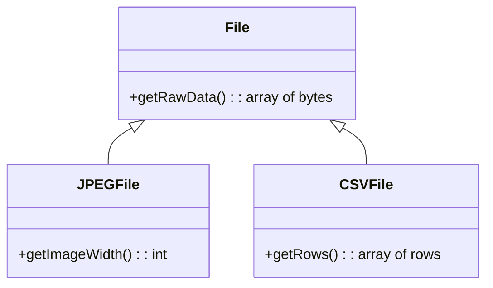
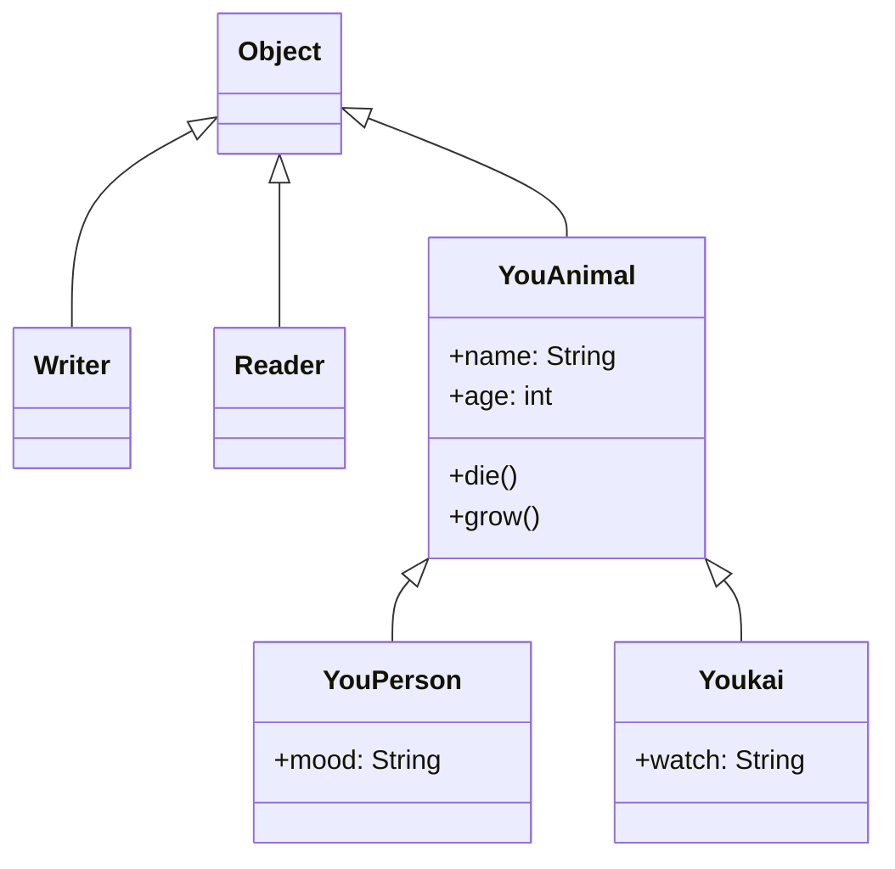
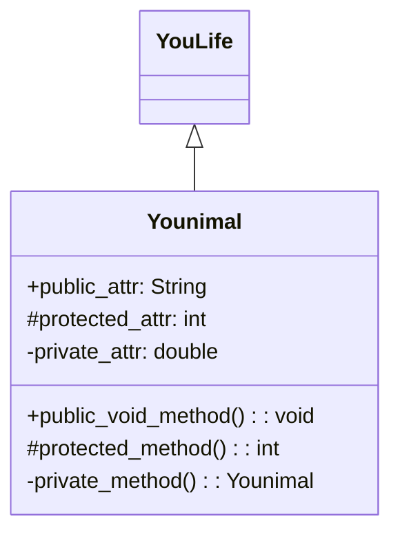

# Object-oriented Programming (OOP)

## Why OOP?
OOP is a philosophy for organising programs, similar to procedural and functional progamming.

In OOP, all actions that the program does is organised around the "object".
An object represents a state machine, or an abstraction that protects its internal state (represented by its instance variables) from corruption.
It primarily does this by limiting access to internal state (called encapsulation): objects only allow methods (written for the class) to edit its internal state (called behaviour, implemented by methods), allowing checks to be performed on the state modification.
Some OOP introductions also use the notion of identity, which is a unique reference to an object (typically a address in memory (CPython's `id()` builtin function)). It may also be equal to the variable name.

## Attributes and Methods

For example, in Smalltalk, `1` would be an object with a `+` attribute (called message in Smalltalk jargon).
`1 + 2` would mean "invoke the `+` method of `1` with an argument of `2`" (send a message `+` with arguments `2` in Smalltalk jargon).

Another example in Java:
```java
"OOP".replace('O', 'o') // becomes "ooP"
```
`"OOP"` is a `String` object, and has a `replace(char searchChar, char newChar)` method. This would invoke the method (behaviour), and return a new string "ooP".

Some languages (e.g. Python, Ruby) treat methods as attributes that happen to be methods. In Python:
```python3
# define blank class A
class A:
    pass

# instantiate new object b with class A
b = A()
# assign the print function to b.something
b.something = print
# call it like any method
b.something('Hello')
```

Finally, OOP has a notion of polymorphism, which means that many different objects and classes can be treated as the same one.
For example, we can have the following (simplified) class hierarchy:



We can put a `JPEGFile` object into a variable with type `File`, and treat it as a `File` object, calling `getRawData()`, for example.
This allows us to use the same code and have slightly different functionality for the small parts (e.g. we can have a `OnlineFile` which accesses the file online for `getRawData()`).

Here's another example:

```java
public class YouLife {
    sleep() {
        System.out.println("I shall go sleep.");
    }
}
class Animal extends YouLife {
    public String name;
    YouLife(String name) { # define a constructor such that `new Animal("John")` works.
        this.name = name;
    }

    @override # signify that we want to override this method
    void sleep() {
        System.out.println(this.name + " goes to sleep.");
    }
}

YouLife l = new Animal("John");
l.sleep(); # calls Animal class' sleep method, but acts like a YouLife object
```

## Classes
Althought classes are a staple of OOP, classes are not always required or even exist. For eaxmple, in JavaScript there is no class that has special behaviour compared to objects.
Classes can be thought of as a template to create objects. In languages like Java, an object can only be made using a class as a template (called instantiation).
They can also have attributes (instance variables) and methods, which operate on the object.

```java
public class MailSender {
    private SMTPConnection conn;

    MailSender(String server) throws IOException {
    	conn = new SMTPConnection(server);
    }
    
    public void sendMail(Mail[] ms) { /* ... */ }
}
```

### Syntax

```java
modifier class ClassName {
    // class body, including attributes (instance/class variables and methods)
}
```

### Main Method

A **main method** is a normal method treated specially by Java. It's normal form is as follows (run using `java Minecraft.java`):

```java
public class Minecraft {
    public static void main(String[] args) { /* ... */ }
}
```

It must be `public static void main` to be recognized and run by Java.

A **driver class** contains a main method along with some other code to run an application (in the example above, `Minecraft` would be a driver class).

## Abstract Classes and Interfaces
There seems to be some confusion between the two, as they are both very similar.
The main differences are:
- a class can implement multiple interfaces, but can only inherit one abstract class, and
- abstract classes can have their own state (i.e. instance variables) (interfaces cannot).
Interfaces are useful when you may have an implementation that implements multiple interfaces.

An example of an interface is the `Iterable<T>` interface (pseudocode):
```java
public interface Iterable<T> {
    Iterator<T> iterator();

    default void forEach(Action<? super T> action) {
        for (T t : this) action.apply(t);
    }
}
```
(`? super T` means a type that is `T` or a superclass of `T`.)

A list class may implement `Iterable<T>` and also implement `Comparable<T>`. An abstract class would not allow multiple interfaces, so interfaces are used here.

Abstract classes are useful when you want to have internal state. An example is the `Writer` class (pseudocode):
```java
public abstract class Writer {
    private char[] writeBuffer;
    private static final int WRITE_BUFFER_SIZE = 1024;
    public abstract void write(char buf[]) throws IOException;
}
```

```java
public abstract class MailSender {
    public abstract void sendMail(Mail m) { }
    public void sendMail(Mail[] ms) {
        // ignoring error handling (specifically: handling when some mail fails)
        for (Mail m : ms) {
            sendMail(m);
        }
    }
}
```

## Visibility
This is important in OOP as one of the main ideas is to prevent outsiders (e.g. sleep-deprived programmers) from making mistakes (e.g. by setting an invalid file descriptor).

Java provides a visibility system separating classes hierarchy from each other. These visibility modifiers can be put in a declaration to extend visibility from the class itself to:
- `public`: anything
- nothing: anything in the same package
- `protected`: any subclass
- `private`: nothing

Private attributes are useful for storing easily-corrupted internal state. (I don't see a point for public class/instance variables, as they can also be corrupted.)

Some languages, such as Ruby or Clojure, provide instance-private methods where the object can only accces its own attributes, but not of another instance of the same (or sub-) class.

```ruby
class Class
  private
  def priv_method(other)
    other.priv_method # errors with NoMethodError (private method `priv_method' called for #<Class:0x...>)
  end
end
```

## So?

Although there are many differences in implementation, most OOP environments have the notions of abstraction, encapsulation, inheritance, and polymorphism.
Using these methods, we can make easy-to-understand and concise object-oriented code.

## UML
~~YouML~~ UML is a visual language used to describe class hierarchies in object-oriented systems.



A UML class has 3 main sections: the class name (Younimal), attributes, and methods.



Each of the prefixes correspond to a visbility (in Java, for example):

|Symbol|Java Keyword|Name           |
|------|------------|---------------|
|`+`   |`public`    |Public         |
|`#`   |`protected` |Protected      |
|`-`   |`private`   |Private        |
|`~`   |*none*      |Package Private|

This page uses [Mermaid](https://mermaid.js.org/) to generate the UML, which is pretty good and well-documented.
It also has a [live editor](https://mermaid.live).

## Bibliography

- https://docs.oracle.com/javase/tutorial/i18n/text/string.html
- https://docs.oracle.com/javase/tutorial/java/index.html and its children pages
- https://www.uml-diagrams.org/visibility.html for UML visibility prefixes
