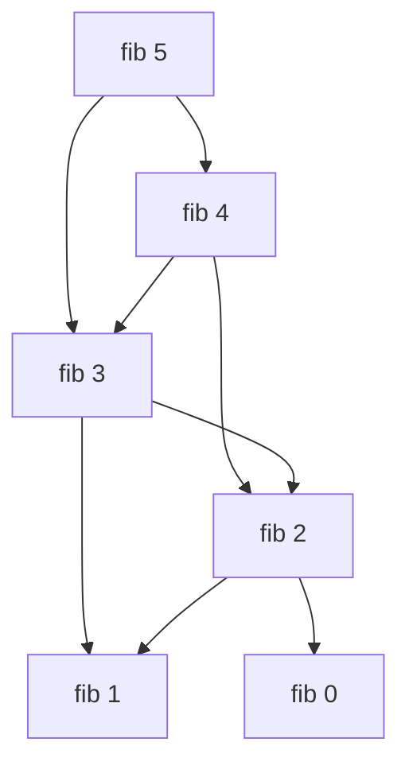
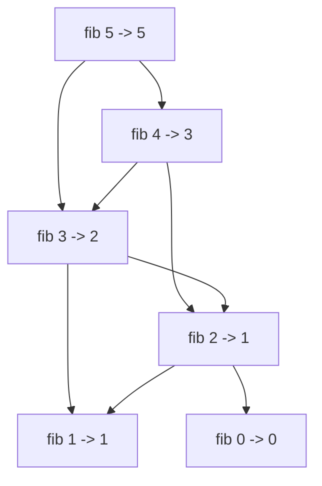

# Recursion

Recursion is a (in my opinion) beautiful way to declaratively represent functions.

Let's take the example of the Fibonacci numbers. A classical (not particularly effective) pseudocode implementation is as follows:

```haskell
# means fib(n=0) returns 0
fib 0 = 0
fib 1 = 1
# used when n is not 0 or 1
fib n = fib (n-1) + fib (n-2)
```

Here, `fib 0` is defined as `0`, 1 as 1, and `fib n` is defined as the penultimate plus the antepenultimate value.

An iterative implementation of the above is as follows:

```java
int fib(int n) {
    // two latest parts of the sequence
    int a = 0;
    int b = 1;
    for (int i = 0; i < n; i ++) {
    	int tmp = a + b;
	a = b;
	b = tmp;
    }
    return a;
}
```

As you can see, the iterative implementation is less declarative (farther away in terms of representation from what we want to implement).
This generally means the code is more confusing (or [clever!](https://dave.cheney.net/paste/clear-is-better-than-clever.pdf)).

## Tail Calls

In recursion, a tail call is a (series of) function(s) that calls itself as the *last* instruction the machine executes.

```java
int fib(int n) { return fib(n, 0, 1) }
int fib(int n, int a, int b) {
    if (n == 0) return a;
    if (n == 1) return b;
    return fib(n-1, b, a+b) // <- the tail call
}
```

In this case, we can rewrite the tail call to be this:

```java
int fib(int n, int a, int b) {
    do {
        if (n == 0) return a; // "base case"
	if (n == 1) return b; // ditto
	n --;
	int tmp = b;
	b = a + b;
	a = tmp;
	continue // goto "start"
    } while (false);
}
```

This version would not use any more of stack space (function calls).

Some functional languages (such as Scala and Haskell) optimise away tail calls (called tail call optimisation) to reduce the stack space used.

In Java, Recursion is actually pretty simple, as there is no tail call optimisation (although you can emulate it using do-while loops, as shown above), etc.

## Base Case

In many programming tutorials, recursion is taught with a "base case." This is the branch of the recursive function that does not require itself anymore. It is also similar to the base case in mathematical induction (hmm, does it come from there?).

```haskell
-- base cases
fib 0 = 0
fib 1 = 1

-- "recursive case"
fib n = fib (n-1) + fib (n-2)
```

I think this is mainly used to help avoid divergent (nonterminating or unable to determine if it diverges (ha! the definition itself is recursive!)) programs. It may be useful in that sense, but I find it unnecessary to think of all the time.

## Stack Overflow

When writing recursive functions, you may have a case where the function does not terminate (diverges). As function calls in most languages like Java are implemented using call stacks, where a new call adds a call stack with information e.g. arguments, where to return to, etc:

```
--- Call Stack ---
|name|args|
|main|{}  |
|test|    |
|fib |4   |
|fib |3   |
|fib |2   |
    ...
```

This makes the language (runtime) use up so much memory making call stacks, that it runs out of memory (!). This is called a "stack overflow" and is the namesake of [this website](https://stackoverflow.com).

Since you do not want this to happen (I hope) and the program to crash, you have to make sure that the recursive function terminates in a finite amount of calls or forcibly terminate with an error if the number of calls exceed an amount.
Another way to reduce memory usage is to do tail call optimisation (above), as this uses O(1) (a constant amount of) memory instead of O(n) (a linear amount of (per call)) memory (it's a simple while loop).

## Sample Algorithms

### Is This a Prime?

We want to check if a number, `n`, is a prime or not. Now, what is a prime? It is a number that can only be divided (with no remainder or into an integer) by itself and 1.

To make a recursive function to check for this property, we can have a few cases where we know the answer:
- n < 2 - no (positive) integer under 2 are prime
- n = 2 - 2 is a prime
- divisor > sqrt(n) - value larger than square root of n cannot be a divisor of n
- n mod divisor = 0 - n is divisible by divisor, so not a prime (we restricted divisor before)

```java
boolean isPrime(int n) { return isPrime(n, 2) }

boolean isPrime(int n, int divisor) {
    if (n < 2) return false;
    if (n == 2) return true;
    if (divisor*divisor > n) return true; // only check until square root of n
    if (n % divisor == 0) return false; // divisible
    return isPrime(n, divisor+1);
}
```

## Evaluating Recursion in Your Head

(Why? We sometimes need to do this on the AP exam.)

The method I use to evaluate recursive functions is to make a call tree:



I write a function call, and what function it calls, in turn. This allows me to annotate results in the path:


